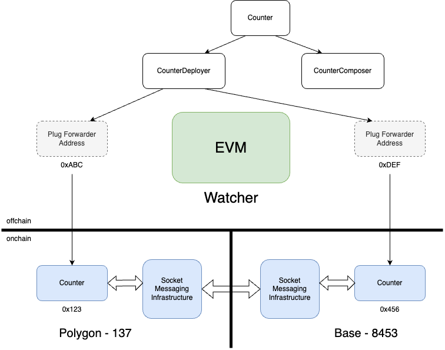

# Getting Started with Socket Chain Abstraction

This guide will help you build chain-abstracted applications using our framework. The framework simplifies the development of applications that need to interact across different blockchains.

## Table of Contents

- [Overview](#overview)
- [Deploying a chain-abstracted Counter contract](#deploying-a-counter)
  - [Incrementing the counter](#incrementing-the-counter-on-a-specific-chain)
  - [Covering gas and fees to be executed onchain](#paying-for-your-transaction-to-be-sent-onchain)
- [What We Just Deployed](#what-we-just-deployed)
  - [Architecture](#architecture-details)

---

## Overview

We will explore a chain-abstracted version of the `Counter.sol` contract, inspired by the default Foundry example. The purpose of this example is to demonstrate how to implement counter logic in a way that abstracts away the details of the specific blockchain where the contract is deployed.

The goal is to provide a simple and intuitive interface for increasing a counter, ensuring that the underlying logic works seamlessly across different chains without requiring the developer to manage chain-specific details or configurations.

---
## Getting Started

### Create Your Counter Deployer Contract
```solidity
contract CounterDeployer is AppDeployerBase {
    address public counterPlug;

    constructor(
        address addressResolver_,
        FeesData memory feesData_
    ) AppDeployerBase(addressResolver_, feesData_) Ownable(msg.sender) {
        counterPlug = address(new CounterPlug());
        creationCodeWithArgs[counterPlug] = type(CounterPlug).creationCode;
    }

    function deployContracts(
        uint32 chainSlug
    ) external queueAndDeploy(chainSlug) {
        _deploy(counterPlug);
    }

    function initialize(uint32 chainSlug) public override queueAndExecute {
        address payloadDeliveryPlug = watcher().appGatewayPlugs(
            addressResolver.auctionHouse(),
            chainSlug
        );

        CounterPlug(forwarderAddresses[counterPlug][chainSlug]).setSocket(
            payloadDeliveryPlug
        );
    }
}

```

### Create your Chain-abstracted Counter App

```solidity
contract CounterGateway is AppGatewayBase {
    constructor(
        address _addressResolver,
        address deployerContract_,
        FeesData memory feesData_
    ) AppGatewayBase(_addressResolver, feesData_) Ownable(msg.sender) {
        addressResolver.setContractsToGateways(deployerContract_);
    }

    function incrementCounter(address _instance) public queueAndExecute {
        CounterPlug(_instance).increase();
    }
}

```


### Create your Counter Contract (deployed on chain)

```solidity
contract CounterPlug is Ownable(msg.sender) {
    address public socket;
    uint256 public counter;

    modifier onlySocket() {
        require(msg.sender == socket, "not sokcet");
        _;
    }

    function setSocket(address _socket) external onlyOwner {
        socket = _socket;
    }

    function getSocket() external view returns (address) {
        return socket;
    }

    function increase() external onlySocket {
        counter++;
    }
}

```

## Deploying a Counter

Let's start by deploying a chain-abstracted Counter Deployer Contract by following these steps:

1. **Setup Environment Variables**

   - Copy the `.env.sample` file and set your `$PRIVATE_KEY`. Ensure it begins with `0x`
     ```bash
     cp .env.sample .env
     ```

2. **Deploy Contracts**

   - Use Foundry to deploy the contracts:
     ```bash
     source .env ; forge script scripts/CounterDeploy.s.sol --broadcast --rpc-url $SOCKET_RPC --verify
     ```
   - For more details on what was deployed, see [What We Just Deployed](#what-we-just-deployed). Otherwise, continue to increment the counter on a specific chain

---

## Incrementing the Counter on a Specific Chain

To increment a counter on a specific chain, use `cast` as follows:

```bash
cast send <CONTRACT_ADDRESS> "incrementCounter(address)" <FORWARDER_ADDRESS> --private-key $PRIVATE_KEY --rpc-url $SOCKET_RPC
```

- Ensure `$PRIVATE_KEY` and `$SOCKET_RPC` are correctly set in your `.env` file
- Replace `<CONTRACT_ADDRESS>` with the address of the deployed `CounterGateway` contract
- Replace `<FORWARDER_ADDRESS>` with the Forwarder address of the instance to increment
  To get the Forwarder address of the onchain contracts, you have two options:

  1. Read the variable `counterPlug` address from the CounterDeployer contract on the explorer or run

  ```bash
  cast call <COUNTER_DEPLOYER_ADDRESS> "counterPlug()" --rpc-url $SOCKET_RPC`
  ```

  - Replace `<COUNTER_DEPLOYER_ADDRESS>` with the address of the deployed `CounterDeployer` contract

  2. Read `forwarderAddresses(counterPlugAddress, chainSlug)` from the CounterDeployer contract on the explorer or run

  ```bash
  cast call <COUNTER_DEPLOYER_ADDRESS> "forwarderAddresses(address,uint32)(address)" <COUNTER_PLUG_ADDRESS> <CHAIN_SLUG> --rpc-url $SOCKET_RPC
  ```

  - Replace `<COUNTER_DEPLOYER_ADDRESS>` with the address of the deployed `CounterDeployer` contract
  - Replace `<COUNTER_PLUG_ADDRESS>` with the address of the deployed `CounterPlug` contract

Each chain that has a contract deployed maintains a Forwarder Address on the Watcher VM that allows for seamless chain-abstracted functionality. Learn more about the architecture details [here](#architecture-details)

---

## Validating that the payload was sent

To ensure and validate the payload to `incrementCounter` was sent to the Watcher Contract be executed onchain run:

```bash
cast logs --from-block <BLOCK_NUMBER_FROM_TX> --address <WATCHER_CONTRACT_ADDRESS> "FinalizeRequested(bytes32,(address,address,uint256,bytes,address,bytes32))" --rpc-url $SOCKET_RPC
```

- Replace `<BLOCK_NUMBER_FROM_TX>` with the block number from the submitted transaction to increment the counter.

  ```bash
  cast receipt <TX_HASH> blockNumber --rpc-url $SOCKET_RPC
  ```

  - Replace `<TX_HASH>` with the transaction hash for the `cast send` to increment the counter

- Replace `<WATCHER_CONTRACT_ADDRESS>` with the address of the deployed `Watcher` contract

  ```bash
  cast call <COUNTER_DEPLOYER_ADDRESS>  "watcher()" --rpc-url $SOCKET_RPC
  ```

  - Replace `<COUNTER_DEPLOYER_ADDRESS>` with the address of the deployed `CounterDeployer` contract

Depending on how quickly you search for it you will eventually see two events on the Watcher Contract related to your increment counter transaction:

1. The first event (`FinalizeRequested`) is emitted when sending the payload to Watcher to sign
2. The second event (`Finalized`) is emitted when the Watcher is submitting signature

The `FinalizeRequested` event will not be emitted for your transaction if there is not enough to cover for gas and fees present on the `PayloadDeliveryPlug` contract as there will not be a Transmitter bidding for your transaction. Find more about paying for transactions [here](#paying-for-your-transaction-to-be-sent-onchain).

Currently, Socket is relaying all transactions onchain so execution will not stop. In the near future, the Transmitter will check if it has enough to charge for gas and fees before bidding for the transaction to be executed onchain.

---

## Paying for your transaction to be sent onchain

In the example `Counter.s.sol`, it was chosen to pay up to 0.01 Ether in Arbitrum Sepolia.

```solidity
FeesData memory feesData = FeesData({
    feePoolChain: 421614,
    feePoolToken: ETH_ADDRESS,
    maxFees: 0.01 ether
});
```

This means that any onchain transaction on any chain that our contract was deployed on (in this case, Optimism Sepolia and Arbitrum Sepolia) will be paid in Arbitrum Sepolia Ether.

To pay for this increment counter transaction, deposit `ETH` to `0xe396468dFcBbccedD1B464300b036D0B8722f3FF` - contract address of the `PayloadDeliveryPlug` in Arbitrum Sepolia - by running:

```bash
cast send 0xe396468dFcBbccedD1B464300b036D0B8722f3FF "deposit(address,uint256,address)" \
    0xEeeeeEeeeEeEeeEeEeEeeEEEeeeeEeeeeeeeEEeE \
    <AMOUNT> \
    <COUNTER_GATEWAY_ADDRESS> \
    --rpc-url https://sepolia-rollup.arbitrum.io/rpc \
    --private-key $PRIVATE_KEY
```

- Replace `<AMOUNT>` with more than 0.01 ETH
- Replace `<COUNTER_GATEWAY_ADDRESS>` with the address of the deployed `CounterGateway` contract

### How to pay fees through any chain

In Socket's chain abstraction you state in which chain, which token and how much you're willing to pay when deploying the Deployer and Application Gateway contracts. This information is sent in the `FeesData` structure of the `constructor` arguments.

```solidity
struct FeesData {
  uint32 feePoolChain;
  address feePoolToken;
  uint256 maxFees;
}
```

The Watcher VM will then take that information into account when submitting any onchain transaction. Find out in which chains you can pay for gas [here](https://github.com/SocketDotTech/socket-poc/blob/main/deployments/dev_addresses.json).

---

## API Description

This API provides essential debugging endpoints to help you troubleshoot and monitor your payload processing pipeline. You can track individual payloads, inspect batch operations, verify gateway interactions, and retrieve forwarder addresses. These endpoints are designed to give you visibility into transaction status, execution details, and system configurations when you need to understand what's happening under the hood.

Base URL  :  https://72e5x0myo8.execute-api.us-east-1.amazonaws.com/dev/ 
| **Endpoint**                      | **Method**                                                  | **Description**                                                     | **Parameters**                                                                                                                                        | **Returns**                                                                                |
| ----------                        | ---------                                                   | -------------                                                       | ------------                                                                                                                                          | ---------                                                                                  |
| `/getForwarderAddress`            | GET                                                         | Returns forwarder address for given chain and contract parameters   | - `chainSlug` (string): Chain identifier - `contractName` (string): Name of the contract - `appDeployerAddress` (string): Address of the app deployer | Forwarder address for the specified parameters                                             |
| `/payloadDetails`                 | GET                                                         | Returns details for a specific payload                              | `payloadId` (string): The ID of the payload to fetch details for                                                                                      | Object containing payload details including status, transaction hashes, and execution data |
| `/payloadBatchDetails`            | GET                                                         | Returns details for a specific payload batch                        | `payloadBatchHash` (string): Hash of the payload batch to fetch details for                                                                           | Object containing batch details including contained payloads, fees, and auction status     |
| `/payloadBatchHashesByAppGateway` | GET                                                         | Returns payload batch hashes associated with an app gateway address | `appGateway` (string): Address of the app gateway to fetch batches for                                                                                | Array of payload batch hashes                                                              |
| `/payloadBatchesByVMTxHash`       | GET                                                         | Returns payload batches associated with a VM transaction hash       | `vmTxHash` (string): Transaction hash to fetch batches for                                                                                            | Array of payload batch details                                                             |

---

## What We Just Deployed

By running the deployment script, we deployed three key contracts:

1. **Deployer Contract**

   - Handles contract deployment across multiple chains.
   - Configures chain-abstracted connections.
   - Sets up permissions and manages relationships between contracts.

2. **Application Gateway Contract**

   - Implements the core business logic.
   - Handles cross-chain message processing.
   - Manages state transitions across different chains.

3. **Logic Contract**
   - Provides chain-specific functionality.

### Architecture Details

- **Deployer and Application Gateway Contracts**: These live on an _offchain_ Watcher VM. The Watcher VM monitors cross-chain events and triggers _onchain_ actions on the contracts deployed on respective chains.
- **Logic Contract**: This is the _onchain_ component responsible for chain-specific logic and integration.



