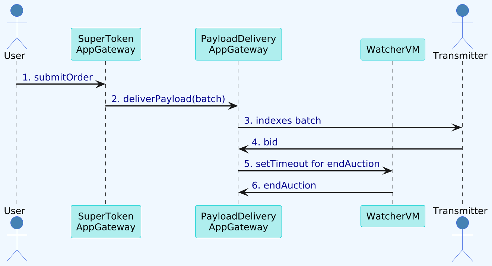
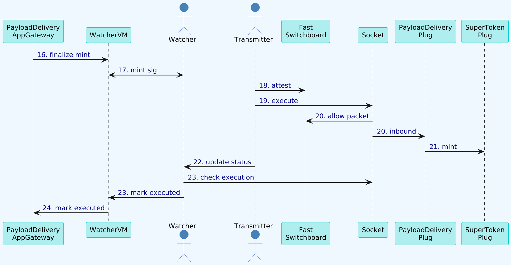
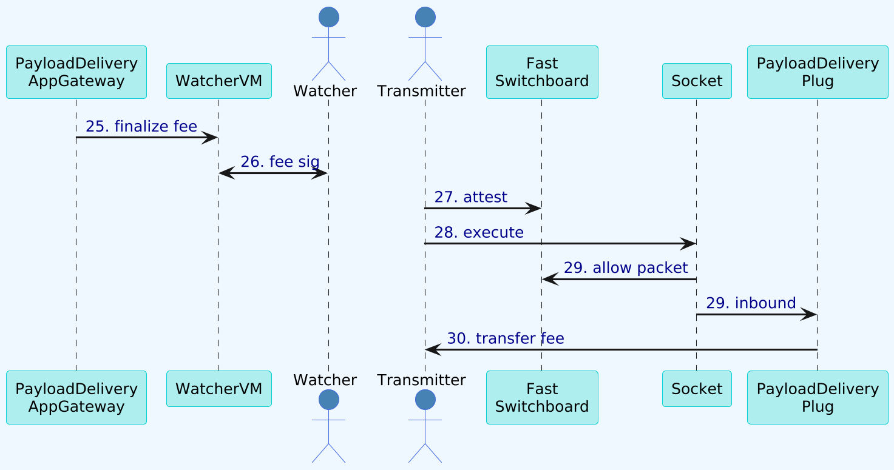

### 3. Example App - SuperToken

SuperToken is an example application that demonstrates how to build a chain abstracted token using the Socket Protocol. This example serves as a reference for developers looking to create their own applications on top of Socket.

#### Components

SuperToken consists of three main components:

1. **SuperToken Contract**: An ERC20-compliant token contract with additional functionality for chain abstraction.
2. **SuperTokenAppGateway Contract**: The application gateway that handles the logic for chain abstracted token transfers.
3. **ConnectorPlug Contract**: The plug contract that interacts with the Socket Protocol and executes token minting and burning on each chain.

#### How it Works

1. Users submit transfer orders through the SuperTokenAppGateway contract.
2. The app creates burn and mint payloads for the source and destination chains.
3. The payloads are sent to Socket's Delivery system to automatically auction and execute onchain.

#### SuperToken Detailed Lifecycle

##### User Order Auction

1. User submitOrder to SuperTokenAppGateway
2. SuperTokenAppGateway deliverPayload(burn,mint) sent to PayloadDeliveryAppGateway
3. PayloadDeliveryAppGateway sends batch to transmitter
4. Transmitter calls bid on PayloadDeliveryAppGateway
5. PayloadDeliveryAppGateway calls WatcherVm to setTimeout for endAuction
6. WatcherVm calls endAuction on PayloadDeliveryAppGateway

##### Burn Execution

7. PayloadDeliveryAppGateway calls finalize for burn payload on WatcherVM
8. Watcher reads finalize request and puts signature on WatcherVM
9. Transmitter picks signature and calls attest on FastSwitchboard.
10. Transmitter calls execute on Socket.
11. Socket checks if packet is allowed by FastSwitchboard and calls inbound on PayloadDeliveryPlug.
12. PayloadDeliveryPlug calls burn on SuperTokenPlug.
13. Transmitter calls updateExecutionStatus on Watcher.
14. Watcher checks if payload executed on Socket and calls markPayloadExecuted on WatcherVM.
15. WatcherVM calls markPayloadExecuted on PayloadDeliveryAppGateway.

##### Mint Execution

16. PayloadDeliveryAppGateway calls finalize for mint payload on WatcherVM.
17. Watcher reads finalize request and puts signature on WatcherVM.
18. Transmitter picks signature and calls attest on FastSwitchboard.
19. Transmitter calls execute on Socket.
20. Socket checks if packet is allowed by FastSwitchboard and calls inbound on PayloadDeliveryPlug.
21. PayloadDeliveryPlug calls mint on SuperTokenPlug.
22. Transmitter calls updateExecutionStatus on Watcher.
23. Watcher checks if payload executed on Socket and calls markPayloadExecuted on WatcherVM.
24. WatcherVM calls markPayloadExecuted on PayloadDeliveryAppGateway.

##### Fee Collection

25. PayloadDeliveryAppGateway calls finalize for fee payload on WatcherVM.
26. Watcher reads finalize request and puts signature on WatcherVM.
27. Transmitter picks signature and calls attest on FastSwitchboard.
28. Transmitter calls execute on Socket.
29. Socket checks if packet is allowed by FastSwitchboard and calls inbound on PayloadDeliveryPlug.
30. PayloadDeliveryPlug transfers fee to transmitter.
